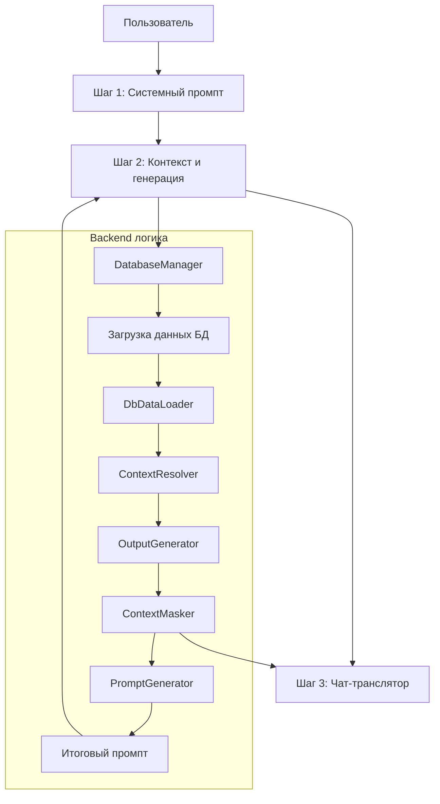

# Prompt Builder — Обзор проекта

## 📌 Суть проекта
**Prompt Builder** — это веб-приложение на Streamlit, предназначенное для построения, версионирования и безопасной обработки промптов для Large Language Models (LLM). Основная цель — автоматизировать подготовку контекстно-насыщенных промптов с маскированием конфиденциальных данных (например, названий таблиц, полей, параметров) и обеспечить обратную расшифровку ответов LLM.

Ключевые возможности:
- **Версионирование системных промптов** — сохранение, загрузка и управление разными версиями системных промптов.
- **Контекстный поиск** — извлечение релевантной схемы БД (PostgreSQL) для заданного namespace.
- **Маскирование данных** — автоматическая замена реальных имён объектов на абстрактные маски (например, `person` → `ENT_1`).
- **Расшифровка ответов** — восстановление оригинальных имён из замаскированных ответов LLM.
- **Токенизация** — подсчёт токенов в промптах с использованием быстрого Rust-токенизатора.

## 🗂️ Структура файлов

### Корневые файлы
- **`app.py`** — точка входа, инициализирует Streamlit-приложение, настраивает страницу и рендерит три основных шага.
- **`requirements.txt`** — зависимости Python (Streamlit 1.51.0, psycopg2, tokenizers и др.).
- **`.python-version`** — указание версии Python (3.12.10).
- **`README.md`** — документация по установке, использованию и архитектуре.
- **`LICENSE`** — лицензия Apache 2.0.
- **`.gitignore`** — шаблоны игнорируемых файлов (логи, виртуальные окружения, данные версий).

### Каталоги и модули

#### `config/`
- **`settings.py`** — централизованные настройки: конфигурация страницы, лимиты токенов, текстовые сообщения, параметры БД.

#### `core/` (ядро логики)
- **`context_engine.py`** — загрузка данных БД, разрешение контекста (граф сущностей), генерация SQL-вставок с маскированием.
- **`masking.py`** — класс `ContextMasker` для регистрации и замены реальных имён на маски и обратно.
- **`prompt_generator.py`** — сборка финального промпта из системного промпта, контекста SQL и пользовательского запроса.
- **`version_manager.py`** — управление версиями системных промптов (сохранение/загрузка в JSON-файл).

#### `services/`
- **`database.py`** — менеджер подключения к PostgreSQL, пул соединений, загрузка данных по namespace.

#### `ui/` (пользовательский интерфейс)
- **`components.py`** — переиспользуемые компоненты Streamlit: анимированный заголовок, кнопки, счётчик токенов, превью версий.
- **`styles.py`** — кастомные CSS-стили для улучшения визуального оформления.
- **`pages/`** — три шага приложения:
  - `step1_system_prompt.py` — настройка и управление версиями системного промпта.
  - `step2_context.py` — загрузка контекста из БД, выбор datasets/entities, генерация промпта с маскированием.
  - `step3_chat.py` — чат-транслятор для шифрования/расшифровки диалога с LLM.

#### `utils/` (вспомогательные утилиты)
- **`logger.py`** — настройка логгирования в файл и консоль.
- **`session.py`** — инициализация и управление состоянием Streamlit session_state.
- **`tokenizer.py`** — подсчёт токенов через библиотеку `tokenizers` (Rust).
- **`helpers.py`** — вспомогательные функции (копирование в буфер, обрезка строк).

## 🏗️ Архитектура и потоки данных

### Общая схема работы

### Детализация шагов

#### 1. **Шаг 1 — Системный промпт**
- Пользователь вводит или загружает системный промпт.
- Версии сохраняются в `prompt_versions.json` через `VersionManager`.
- Интерфейс: текстовое поле + панель управления версиями (сохранить/загрузить/удалить).

#### 2. **Шаг 2 — Контекст и генерация**
- Выбор namespace из БД → загрузка схемы (таблицы, сущности, параметры).
- Выбор datasets/entities для включения в контекст.
- Генерация SQL-вставок, отражающих выбранный контекст.
- Маскирование имён через `ContextMasker` (реальные → маски).
- Сборка финального промпта: системный промпт + SQL-контекст + пользовательский запрос.
- Подсчёт токенов, отображение замаскированного и оригинального вариантов.

#### 3. **Шаг 3 — Чат-транслятор**
- Двустороннее преобразование: реальный текст ↔ замаскированный текст.
- Использует тот же словарь замен, что и на шаге 2.
- Позволяет безопасно отправлять замаскированные запросы в LLM и расшифровывать ответы.

### Маскирование данных
- **Категории масок**: `dataset`, `entity`, `property`, `table`, `parameter`, `other`.
- **Формат масок**: `{префикс}_{номер}` (например, `ENT_1`, `P_2`, `DS_3`).
- **Регистрация**: при первом обнаружении реального имени генерируется уникальная маска.
- **Замена**: в тексте промпта и SQL-контексте реальные имена заменяются на маски с учётом границ слов.
- **Словарь**: хранится в `session_state` для согласованности между шагами.

### Работа с БД
- **Подключение**: PostgreSQL, пул соединений, параметры из переменных окружения.
- **Схема**: база `qe_config`, таблицы `namespaces`, `entities`, `parameters`, `datasets` и др.
- **Загрузка контекста**: фильтрация по `namespace_id`, объединение связанных таблиц.

### Токенизация
- Используется библиотека `tokenizers` (Rust) для быстрого подсчёта токенов.
- Файл токенизатора: `deepseek_tokenizer/tokenizer.json`.
- Fallback: упрощённый подсчёт по словам, если токенизатор недоступен.

## 🛠️ Технологический стек
- **Frontend**: Streamlit 1.51.0
- **Backend**: Python 3.12.10
- **База данных**: PostgreSQL (через psycopg2-binary)
- **Токенизация**: Hugging Face tokenizers (Rust)
- **Логгирование**: стандартный модуль logging с ротацией в файл
- **Стили**: кастомный CSS, встроенный в Streamlit компоненты

## 📈 Возможности расширения
- Поддержка других СУБД (через абстракцию DatabaseManager).
- Интеграция с внешними LLM-API (OpenAI, Anthropic и др.).
- Экспорт/импорт версий промптов в облачное хранилище.
- Расширенная визуализация графа зависимостей сущностей.

## ✅ Итог
Проект представляет собой законченное инструментальное решение для инженеров промптов, работающих с конфиденциальными схемами данных. Он сочетает удобный интерфейс, мощную логику маскирования и гибкое управление версиями, что позволяет безопасно и эффективно готовить промпты для LLM.

Все файлы хорошо структурированы, код сопровождается логгированием и обработкой ошибок, архитектура модульная и легко расширяемая.

---

*Документ создан автоматически на основе анализа кодовой базы. Последнее обновление: 2025-12-02.*